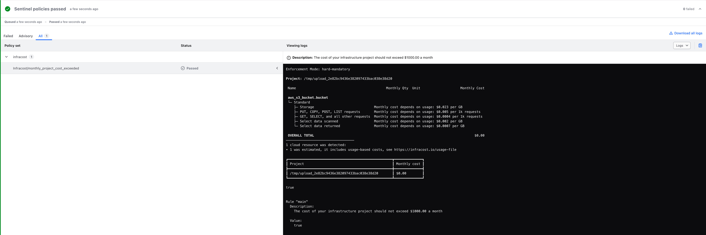
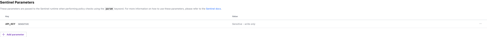

# Infracost Sentinel Module

This repository contains a Sentinel module that can be used within Terraform Cloud/Enterprise to demonstrate how the Sentinel policy as code language can be used to enforce cost management controls.

To learn more about the Sentinel language and framework, please review the Sentinel [documentation](https://docs.hashicorp.com/sentinel/).

---

## Table of Contents
- [Prerequisites](#prerequisites)
- [Documentation](#documentation)
- [Useful Resources](#useful-resources)

---

## Prerequisites

↥ [back to top](#table-of-contents)

Before you start using this module, it is recommended that you do the following:

1. Clone this repository locally.
1. [Install](https://docs.hashicorp.com/sentinel/intro/getting-started/install/) the Sentinel CLI. The CLI is an excellent tool for familiarizing yourself with the internals of Sentinel and allows you to `apply` and `test` policies outside of the Terraform platform. You can find more information related to the Sentinel CLI in the [Enforce Policy with Sentinel](https://learn.hashicorp.com/tutorials/terraform/policy-quickstart?in=terraform/cloud-get-started) learning track.

1. Sign-up for a free Infracost account by following the [Get Started](https://www.infracost.io/docs/infracost_cloud/get_started/) documentation.
1. Retrieve your [API key](https://www.infracost.io/docs/infracost_cloud/key_concepts/#api-keys) and store it in a safe location. We will use this in a later step when we configure the parameter values for the Terraform Cloud policy set.


---

## Documentation

↥ [back to top](#table-of-contents)

### Cost Management as Policy

The [monthly_project_cost_exceeded](./policies/monthly_project_cost_exceeded/monthly_project_cost_exceeded.sentinel) policy shows an example of how you can use the [infracost.sentinel](./imports/modules/infracost.sentinel) module in a Sentinel policy.

The policy uses the module to ensure that the monthly cost of a Infracost project does not exceed $1000.00.

```
import "infracost"

param API_KEY

// The cost of your infrastructure project should not exceed $1000.00 a month
main = rule when infracost.projects.breakdown(API_KEY) {
    infracost.projects.total_monthly_cost(API_KEY).less_than_or_equal_to(1000.00)
}
```

### Infracost Sentinel Module

The `infracost` module uses the Sentinel [HTTP](https://docs.hashicorp.com/sentinel/imports/http) import to `POST` the raw output of the Terraform Plan JSON to the https://pricing.api.infracost.io/breakdown API. The module contains several helper functions that make it easier to work with the data that is returned as part of the `breakdown` API response.

```
import "http"
import "json"
import "decimal"
import "tfplan/v2" as tfplan

projects = {
  "total_monthly_cost": func(token){
    return {
      "less_than_or_equal_to": func(i){
        return all as_json(tfplan.raw, token).projects as _, project {
          decimal.new(project.breakdown.totalMonthlyCost).float <= i
        }
      },
    }
  },
  "breakdown": func(token){
    return print(as_table(tfplan.raw, token))
  },
}

as_json = func(plan, token) {

  body = string(
    "--TerraformPlan\r\n" +
    "Content-Disposition: form-data; name=\"path\"; filename=\"plan.json\"\r\nContent-Type: \"application/json\"\r\n" +
    "\r\n" + json.marshal(plan) + "\r\n" +
    "--TerraformPlan\r\n" +
    "Content-Disposition: form-data; name=\"format\"\r\n" +
    "\r\njson\r\n" +
    "--TerraformPlan--")

  request = http.request("https://pricing.api.infracost.io/breakdown").
    with_header("x-api-key", token).
    with_header("Content-Type", "multipart/form-data;boundary=TerraformPlan").
    with_body(body)

  response = http.post(request)

  return json.unmarshal(response.body)
}

as_table = func(plan, token) {

  body = string(
    "--TerraformPlan\r\n" +
    "Content-Disposition: form-data; name=\"path\"; filename=\"plan.json\"\r\nContent-Type: \"application/json\"\r\n" +
    "\r\n" + json.marshal(plan) + "\r\n" +
    "--TerraformPlan\r\n" +
    "Content-Disposition: form-data; name=\"format\"\r\n" +
    "\r\ntable\r\n" +
    "--TerraformPlan--")

  request = http.request("https://pricing.api.infracost.io/breakdown").
    with_header("x-api-key", token).
    with_header("Content-Type", "multipart/form-data;boundary=TerraformPlan").
    with_body(body)

  response = http.post(request)

  print(response.body)

  return true
}
```

### Integrating with Terraform Cloud

To integrate the Infracost Sentinel module into your existing Terraform Cloud policy workflows, you can utilize the Policy Set feature provided by the Terraform Cloud platform. If you are new to Terraform Cloud and would like to familiarize yourself with the concept of policy sets and how they are used to group and enforce policies in Terraform Cloud, you can refer to the [Managing Policy Sets](https://developer.hashicorp.com/terraform/cloud-docs/policy-enforcement/manage-policy-sets) documentation.



> **Note:** The `monthly_project_cost_exceeded` policy uses an API Key to authenticate against the Infracost breakdown API. To ensure security, it is considered a best practice not to store sensitive values as plain text in a policy. Therefore, you should create a new parameter called `API_KEY` in your Sentinel Policy Set to securely store this value.
> 


## Useful Resources

↥ [back to top](#table-of-contents)
- [Infracost Getting Started](https://www.infracost.io/docs/)
- [Infracost Plan JSON API](https://www.infracost.io/docs/integrations/infracost_api/)
- [Sentinel Documentation](https://docs.hashicorp.com/sentinel/)
- [Sentinel Language](https://docs.hashicorp.com/sentinel/language/)
- [Sentinel Language Specification](https://docs.hashicorp.com/sentinel/language/spec/)
