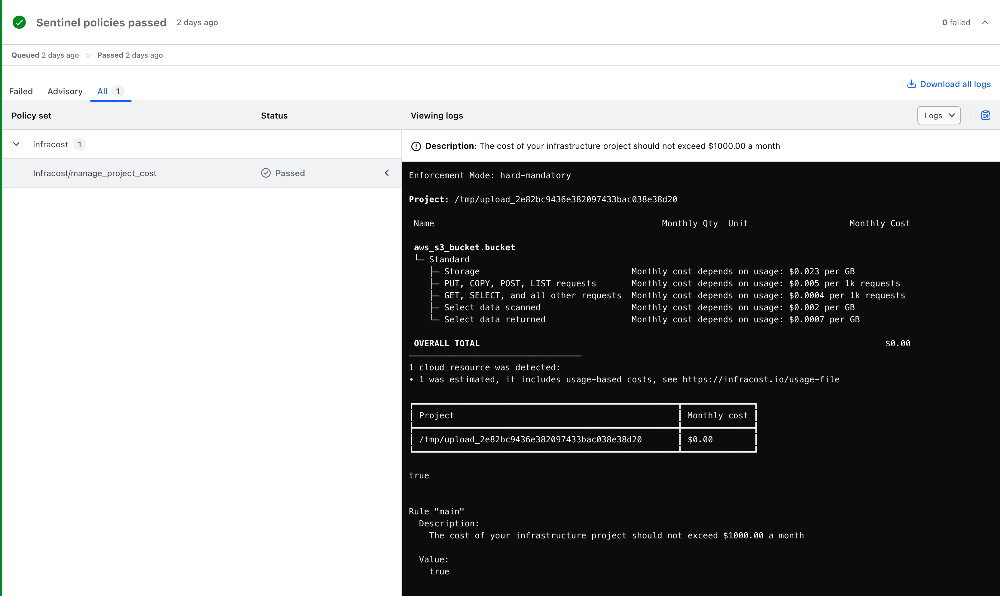

# Cost Management guardrails with Sentinel and Infracost

This repository contains a library of policies that can be used within Terraform Cloud to enforce cost controls with [Infracost](https://www.infracost.io). To learn more about the Sentinel language and framework, please review the Sentinel [documentation](https://docs.hashicorp.com/sentinel/).

---

## Table of Contents

- [Prerequisites](#prerequisites)
- [Documentation](#documentation)
- [Setup & Integration](#setup--integration)
- [Version Control System (VCS)](#version-control-system-vcs)
- [Setup & Integration](#setup--integration)
- [Useful Resources](#useful-resources)
- [Contribution Guide](#contribution-guide)
  
---

## Prerequisites

Before you start adopting policies within this library, it is recommended that you complete the following:

1. [Install](https://docs.hashicorp.com/sentinel/intro/getting-started/install/) the Sentinel CLI.

2. Visit https://app.terraform.io/signup/account and follow the prompts to create a free Terraform Cloud account.
3. Have access to a [supported](https://www.terraform.io/docs/cloud/vcs/index.html#supported-vcs-providers) version control system (VCS) provider.
4. Sign up for an Infracost Cloud organization by following the [Get Started](https://www.infracost.io/docs/infracost_cloud/get_started/) guide.
5. Retrieve your [API key](https://www.infracost.io/docs/infracost_cloud/key_concepts/#api-keys) from your Infracost Cloud Org Settings.

    > **Note:** You will need this API key when you define your policy set parameters in a later [step](#configure-the-policy-set-parameters).

---

## Documentation

The file and directory structure within this repository follow an opinionated standard that makes it easy to test and publish policies to the Terraform Registry. You can learn more about the structure by reviewing the Sentinel [testing documentation](https://docs.hashicorp.com/sentinel/writing/testing#testing), as well as the [Publishing Policy Library documentation](https://developer.hashicorp.com/terraform/registry/policy-libraries/publishing).


### Example

```ruby
.
├── Makefile
├── README.md
├── docs
│   ├── modules
│   │   └── infracost.md
│   └── policies
│       └── manage_project_costs.md
├── images
├── imports
│   ├── modules
│   │   └── infracost.sentinel
│   └── static
│       └── response.json
├── policies
│   └── manage_project_costs
│       ├── manage_project_costs.sentinel
│       ├── test
│       │   └── manage_project_costs
│       │       ├── fail.hcl
│       │       └── pass.hcl
│       └── testdata
│           ├── fail.sentinel
│           ├── infracost-fail.sentinel
│           ├── infracost-pass.sentinel
│           └── pass.sentinel
└── sentinel.hcl
```

---

## Setup & Integration

Before you can use any of the policies within this library, you need to configure Terraform Cloud. The following sections detail the high-level steps required to deploy a policy from this library. The [Enforce Policy with Sentinel](https://learn.hashicorp.com/terraform?track=sentinel#sentinel) learning track covers the end-to-end process in greater detail. If this is your first time setting up a Sentinel policy, we encourage you to familiarize yourself with this track prior to proceeding further.

### Version Control System (VCS)

Terraform Cloud provides first-class support for VCS integration. This allows VCS repositories to contain all of the policies and configuration needed to manage Sentinel policies at scale. [Integrating with VCS](https://www.terraform.io/docs/cloud/getting-started/policies.html#integrating-with-vcs) is as simple as:

1. [Connect a VCS Provider to Terraform Cloud](https://www.terraform.io/docs/cloud/vcs/index.html).
2. Create a repository in your VCS provider that will be used as the source of your Policy Set configuration.
3. Clone the source repository to a local directory.

### Policy Set

Once VCS is integrated with Terraform Cloud, configure your Terraform Policy Set as follows:

1. Add the `manage_project_costs` policy from the library that should be enforced on a Terraform [Workspace](https://www.terraform.io/docs/cloud/workspaces/index.html).
1. Review the policy documentation and copy the configuration snippet for the policy of your choice.
1. Create a `sentinel.hcl` configuration file within the local directory for your repository.
1. Edit the contents of the `sentinel.hcl` by pasting the configuration snippet into the body of the configuration file.

    ```hcl
    import "module" "infracost" {
      source = "./imports/modules/infracost.sentinel"
    }

    policy "manage_project_costs" {
      source = "./policies/manage_project_costs/manage_project_costs.sentinel"
      enforcement_level = "hard-mandatory"
    }
    ```

1. Commit your changes to your local repository content and then use the `git push` command to upload the changes to your remote repository.

### Create Policy Set

Once the Policy Set is configured, it's time to enforce this configuration on a Terraform Cloud workspace. To add a policy set in the Terraform Cloud UI:

1. Go to **Policy Sets** in your organization’s settings.

1. Click **Connect a new policy set**.

1. Create version control policies, choose a version control provider and then select the repository with your policy set.

1. Configure the policy set settings:
   - **Policy Framework:**  Select **Sentinel** as the policy framework for the policies you want to add.

   - **Name:** Add a name containing letters, numbers, `-`, and `_`.
   - **Description:** Describe the policy set’s purpose.
   - **Scope of policies:** Choose whether Terraform Cloud should automatically enforce the policy set on all workspaces, or only on a specific subset.
   - **Workspaces**: A **Workspaces** section appears on the bottom of the form when you scope the policy set to selected workspaces. Select workspaces where Terraform Cloud should apply the policy set.
   - **VCS Branch**: Specify the branch within your VCS repository where Terraform Cloud should import new versions of policies. If you do not set this field, Terraform Cloud uses the default branch of the VCS repository you selected.
   - **Policies Path**: Specify the sub-directory in your VCS repository containing the policy set files. This action lets you maintain multiple policy sets within a single repository. Set this field to the directory path that contains the `sentinel.hcl` configuration file for the policy set.
   - **Sentinel Parameters:** Add a new *Sensitive* parameter called **x_api_key** that contains the Infracost organization API key that was created in the [prerequisites](#prerequisites)

### Policy Enforcement Experience

When you add policy sets to a workspace, Terraform Cloud enforces those policy sets on every Terraform run. Terraform Cloud displays the results of policy checks in the UI for each run.



---

## Useful Resources

↥ [back to top](#table-of-contents)

- [Getting Started with Terraform Cloud](https://www.terraform.io/docs/cloud/getting-started/index.html)
- [Configuring Version Control Access](https://www.terraform.io/docs/cloud/getting-started/vcs.html)
- [Infracost Getting Started](https://www.infracost.io/docs/)
- [Infracost Plan JSON API](https://www.infracost.io/docs/integrations/infracost_api/)
- [Configuring Sentinel Policies](https://www.terraform.io/docs/cloud/getting-started/policies.html)
- [Sentinel Overview](https://www.terraform.io/docs/cloud/sentinel/index.html)
- [Example Policies](https://www.terraform.io/docs/cloud/sentinel/examples.html)
- [Sentinel Documentation](https://docs.hashicorp.com/sentinel/)
- [Sentinel Language](https://docs.hashicorp.com/sentinel/language/)
- [Sentinel Language Specification](https://docs.hashicorp.com/sentinel/language/spec/)

---

## Contribution Guide

This policy library is by no means exhaustive. If you have questions, comments, or have identified ways for us to improve, please create [a new GitHub issue](https://github.com/hcrhall/sentinel-infracost-module/issues/new/choose).

Alternatively, we welcome any contributions that improve the quality of this library! To learn more about contributing and suggesting changes to this library, refer to the [contributing guide](CONTRIBUTING.md).
